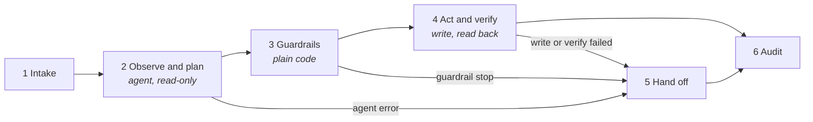

# Aelix Echo agent workflows for n8n

[](https://github.com/Aelix-Echo/aelix-agent-workflows/actions/workflows/ci.yml)


Seven n8n workflows, one for each industry card on [aelixecho.com/ai-agents](https://aelixecho.com/ai-agents). Each one runs the loop the page describes: observe, plan, act, verify, hand off.

| # | Workflow | Industry | Work taken off the desk | Trigger |
|---|---|---|---|---|
| 1 | [`01-fintech-refund-handler`](workflows/01-fintech-refund-handler.json) | FinTech | Refund handling: eligibility check and refund | Webhook |
| 2 | [`02-healthcare-prior-auth-triage`](workflows/02-healthcare-prior-auth-triage.json) | Healthcare | Prior-auth triage: packet assembly and routing | Webhook |
| 3 | [`03-manufacturing-invoice-exception`](workflows/03-manufacturing-invoice-exception.json) | Manufacturing | Invoice exceptions: match, draft, escalate | Webhook |
| 4 | [`04-logistics-shipment-exceptions`](workflows/04-logistics-shipment-exceptions.json) | Logistics | Shipment exceptions: trace, re-plan, escalate | Webhook |
| 5 | [`05-legaltech-contract-intake`](workflows/05-legaltech-contract-intake.json) | LegalTech | Contract intake: classify and route | Webhook |
| 6 | [`06-energy-outage-ticket-triage`](workflows/06-energy-outage-ticket-triage.json) | Energy & Utilities | Outage ticket triage: correlate and dispatch | Every 2 min |
| 7 | [`07-realestate-vendor-onboarding`](workflows/07-realestate-vendor-onboarding.json) | Real Estate & Construction | Vendor onboarding: document collection | Webhook |

## How every workflow is built



- **The agent only reads.** It returns a structured proposal validated against a JSON schema and cannot change a system of record.
- **Guardrails are deterministic code.** They re-read the source of truth and recompute the model's arithmetic instead of trusting it.
- **Writes are idempotent and verified** by reading the record back.
- **Every stop goes to one hand-off**, with the reasons, the proposal and the full tool-call trace, so a person can decide quickly.
- **Every run is audited**, and customers and vendors only ever receive fixed templates.

More in [docs/architecture.md](docs/architecture.md), including what each workflow always leaves to a person.

## Quick start

```bash
psql "$DATABASE_URL" -f sql/schema.sql                 # 1. audit and exception tables
n8n import:workflow --separate --input=workflows/       # 2. import all seven
```

Then connect credentials, edit each **Config** node, and post a file from `samples/` to the test webhook. Full steps in [docs/setup.md](docs/setup.md).

## Repository layout

```
├── workflows/          Ready-to-import n8n workflows (generated, do not edit by hand)
├── src/
│   ├── lib.mjs         Shared builders: agent, guardrails, hand-off, audit, stickies
│   └── workflows/      One source file per workflow: prompts, tools, schema, rules
├── test/               Guardrail, verification and hand-off scenarios (44)
├── scripts/            build.mjs (source to JSON) and validate.mjs (n8n validator)
├── samples/            Example request payloads, one per workflow
├── sql/                Postgres schema for runs, exceptions and the PA worklist
├── docs/               Architecture and setup guides
└── .github/            CI, Dependabot, PR template, code owners
```

## Quality checks

Every push runs [CI](.github/workflows/ci.yml):

| Check | What it proves |
|---|---|
| Build check | The committed JSON is exactly what the source generates |
| Guardrail tests | 44 scenarios across all seven workflows, on Node 22 and 24, with no network or model |
| n8n validation | Node parameters pass n8n's own schema validator; canvas layout and connections are sound |
| Secret scan | No credentials anywhere in the git history |

Run them locally with `npm run check`. See [CONTRIBUTING.md](CONTRIBUTING.md) for the development workflow.

## Status

- **Tested:** all seven import into n8n 2.40.7 and pass its validator; every Code node compiles; the guardrail, verification, safety-screen and hand-off logic passes 44 scenarios.
- **Not yet tested:** live runs against Claude, Stripe, Salesforce or the gateway APIs. Run each workflow first with test-mode keys and staging endpoints.

## Security

Credentials live in n8n, never in this repository. For PHI handling and how to report a vulnerability, see [SECURITY.md](SECURITY.md).
