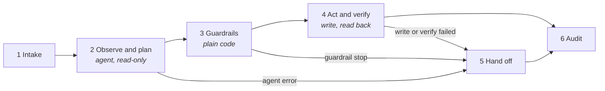

# Architecture

All seven workflows share one design. They are generated from code (`src/lib.mjs` plus one file per workflow in `src/workflows/`), so the stage layout, guardrail pattern, hand-off and audit are identical across industries. Only the prompts, tools, schema and guardrail rules differ.

## The six stages

Every canvas has the same six stages, each inside a colour-coded sticky note. An Overview and a Setup sticky sit on the left of each canvas.

| Stage | What happens | Can change a system of record? |
|---|---|---|
| 1 Intake | Webhook or schedule; the request is normalised and given a business key | No |
| 2 Observe and plan | A Claude agent calls read-only tools and returns a proposal validated against a JSON schema | No |
| 3 Guardrails | A Code node re-reads the system of record and checks the proposal against the limits in **Config** | No |
| 4 Act and verify | Idempotent writes, then a read-back to confirm the system shows the planned result | Yes |
| 5 Hand off | One exception path for every stop: an `agent_exceptions` row and a Slack post | Queue only |
| 6 Audit | One `agent_runs` row per run, whichever way it ended | Audit log only |

## Design principles

- **The agent only reads.** Every tool attached to the AI Agent node is a GET (or a read-only quote). The agent cannot change a system of record.
- **Guardrails are deterministic.** The Guardrails node re-reads the source of truth where it matters (Stripe payment, ERP match view, OMS outage, TMS shipment). The model's arithmetic is recomputed, not trusted.
- **Writes are idempotent and verified.** Write calls carry an idempotency key. The run counts as done only when a read-back shows the planned result.
- **Every stop goes to one hand-off.** Agent errors, guardrail stops, failed writes and failed verification all land in the same place, with the reasons, the proposal, the agent's questions for a person, and every tool call and observation.
- **Customers and vendors only get fixed templates.** Model-written text goes to reviewers, never straight to an outside party.
- **Untrusted text is data.** Customer reasons, carrier notes, contract text and ticket descriptions are passed inside tags and labelled as data, not instructions.
- **One place to tune.** Each workflow has a **Config** node with every limit, tolerance, URL, confidence floor and channel.

## Model

**Claude Opus 5** (`claude-opus-5`, set in `src/lib.mjs`) with adaptive thinking. Effort is high everywhere except Energy, which uses medium for high-volume triage. Prompt caching is on (5 minutes). Change the model on each workflow's `… · Claude` node, or in `MODEL_ID` and rebuild.

## What each workflow will not do

| Workflow | Always goes to a person |
|---|---|
| Refund handler | Denials; refunds above the auto limit, outside the window, on disputed charges or with mismatched identity |
| Prior-auth triage | Every payer submission; urgency disagreements; unknown PA requirement. It never decides medical necessity. |
| Invoice exception | Quantity variances, anything outside tolerance, under-billing, duplicates. Vendor emails are drafts only. |
| Shipment exceptions | Damage, customs, hazmat and address issues; paid re-plans over the cost limit or that still miss the promise |
| Contract intake | Every approval, redline and signature; routing disagreements; counterparty mismatches; scanned PDFs |
| Outage triage | Every crew dispatch; hazard reports (caught by a keyword screen before the model runs); critical customers |
| Vendor onboarding | Every vendor approval; sanctions hits; license-holder mismatches |

## Data model

`sql/schema.sql` (Postgres 13+) creates three tables:

| Table | Purpose |
|---|---|
| `agent_runs` | One row per run: outcome, route, the agent's decision, guardrail reasons, actions taken, tool-call count, model and n8n execution id |
| `agent_exceptions` | The human review queue: team, status, reasons, proposed action, confidence, the agent's questions, the full trace, and resolution fields |
| `pa_worklist` | Healthcare prior-auth worklist. Holds PHI, so restrict access accordingly. |
